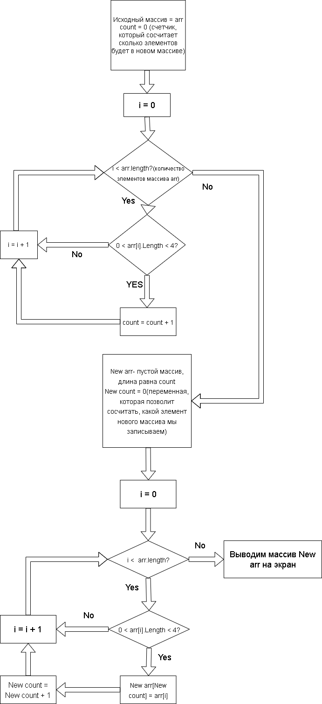

# **Описание решения.**

1. ### *Создаем метод для считывания заданного пользователем значения количества элементов в изначальном массиве.*

2. ### *Добавляем метод, который принимает на вход переменную, равную количеству элементов изначального массива, и создаст этот массив с типом данных строки.* 
 Затем метод заполнит этот массив значениями, введенными пользователем. Затем выведет его на экран, а также возвращает этот массив для дальнейшей работы с ним.

3. ### *Добавляем метод, на вход принимающий изначальный массив.* 
Метод создает новый массив, по размеру равный количеству элементов из изначального массива, длина которых от 1 до 3х символов,  записывает эти элементы в новый массив из изначального массива, а затем выводит новый массив на экран. Данный метод ничего не возвращает.

